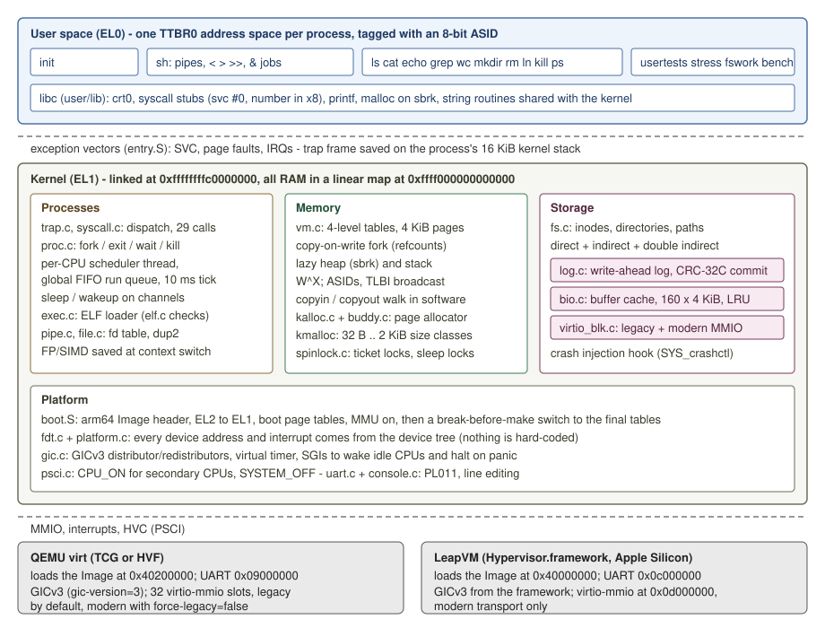

# wren-os

A small multicore Unix-like operating system kernel for 64-bit ARM (AArch64), written from scratch in
C and assembly. It boots the same kernel `Image` on two different virtual machines, QEMU's `virt`
board and LeapVM (a hypervisor for Apple Silicon that I also wrote), discovering every device from
the device tree. It runs a shell with pipes, redirection and background jobs on up to 8 CPUs, and
keeps its files on a disk with a write-ahead log, so the file system stays consistent across power
cuts (tested with 600 injected ones). Its C library includes a conservative garbage collector and a
leak checker that scan the program's registers, stack and globals.

This is a **learning reimplementation** in the style of the operating-systems courses at MIT
(6.1810, xv6), Harvard (CS 161, Chickadee) and Yale (CPSC 422, mCertiKOS). It is not a new idea and
not affiliated with those courses. All code here is my own; the design borrows well-known ideas from
those systems, credited in [Related work](#related-work).

[繁體中文說明](README.zh-TW.md) · [Course-style report](docs/report.md) · [Design notes](docs/DESIGN.md) ·
[Garbage collector](docs/GC.md) · [Beginner's guide (中文)](docs/導讀.zh-TW.md)

```
wren-os: booting on "linux,dummy-virt", image at 0x40200000, 4 cpu(s) in the device tree
memory: 253 MiB free of 256 MiB, kernel 372 KiB
virtio-blk: 0xa003e00, legacy transport, 65536 KiB, flush yes
smp: 4 cpu(s) online
fs: 16384 blocks, 1024 inodes, log 65 blocks at 2
init: starting /bin/sh
$ cat /motd.txt | grep -n wren
1:Welcome to wren-os, a small multicore Unix-like kernel for AArch64.
2:Try: ls /bin, cat /motd.txt | wc, grep -n wren /motd.txt, ps, usertests.
$ echo hello > /hi.txt; cat /hi.txt
hello
$ sleep 2000 &
[1] 9
$ ps
  PID  PPID STATE     CPU    MEM(KiB)  TICKS NAME
    1     0 sleeping    0          24      0 init
    2     1 sleeping    1          32      0 sh
    9     2 sleeping    0          24      0 sleep
   10     2 running     0          24      0 ps
$ usertests -q | grep -v OK
usertests: 4 cpu(s), 64644 free pages
pid 109 (usertests): segmentation fault at 0x33000 (write), pc 0x18ef4: killed
pid 128 (usertests): segmentation fault at 0x33010 (exec), pc 0x33010: killed
...                                  (deliberate faults: the tests check that they are caught)
usertests: 38 passed, 0 failed in 2443 ms
ALL TESTS PASSED
[1] Done  sleep 2000 &
$ poweroff
wren-os: power off
```

(A real session under QEMU with 4 CPUs, unedited except for the elided fault lines.)

## What is in it

| Area | What is implemented |
|---|---|
| Boot | arm64 Linux `Image` header; drops from EL2 to EL1 if entered at EL2; boot page tables built in assembly with the MMU off; kernel in the high half; device tree parsed by my own FDT parser; a break-before-make switch to the final page tables |
| Memory | buddy page allocator with reference counts; 4-level page tables with 4 KiB pages; one address space per process tagged with an ASID; copy-on-write `fork`; lazily allocated heap (`sbrk`) and stack; W^X for user and kernel; kernel heap (`kmalloc`) |
| Traps | exception vectors; system calls via `svc`; page faults (lazy, COW, segfault); GICv3 distributor and redistributors; per-CPU virtual timer; inter-processor interrupts |
| SMP | secondary CPUs started with PSCI `CPU_ON`; ticket spinlocks with a deadlock detector; sleep locks; a preemptive scheduler with one scheduler thread per CPU; FP/SIMD registers switched with the process |
| Processes | `fork exec exit waitpid kill getpid getppid sbrk sleep uptime`, pipes, file descriptors, `dup`/`dup2`, `lseek`, `ps` |
| Storage | virtio-blk driver for both virtio-mmio transports (legacy, which QEMU uses by default; modern, the only one LeapVM has); buffer cache; inode file system with direct, indirect and double-indirect blocks and directories; a write-ahead log with CRC-32C-protected commit records; host `mkfs` and `fsck` |
| User space | small libc; `sh` with pipes, `<` `>` `>>`, `&` and `;`; `ls cat echo grep wc mkdir rm ln kill ps sleep poweroff`; test programs `usertests`, `stress`, `fswork`, `bench` |
| Memory tools | conservative mark-sweep collector (`gc_malloc`): size-class pages with mark bitmaps, interior pointers, mark-stack overflow recovery; a leak checker for `malloc` (`leakcheck prog`, or `leak_check()`) that reports unreachable blocks with their allocation sites; demos `gcdemo`, `leakdemo`, tests `gctest`, benchmark `gcbench` |

About 5,700 lines of kernel C and assembly, 4,200 lines of user space, 500 lines of host tools and
2,400 lines of tests.

## How it works



- **One Image, two machines.** QEMU loads the kernel at `0x40200000` and puts its UART at
  `0x09000000`; LeapVM loads it at `0x40000000` with its UART at `0x0c000000`. The kernel is linked
  at a fixed virtual address (`0xffffffffc0000000`) and maps itself there from wherever it landed;
  memory, CPUs, the GIC, the timer interrupt, the UART and the virtio slots all come from the
  device tree the hypervisor passes in `x0`.
- **System calls** are `svc #0` with the number in `x8`. The kernel never dereferences user
  pointers: `copyin`/`copyout` walk the process's page table in software and fault pages in (lazy or
  copy-on-write) on the way, so a bad pointer is an `EFAULT`, never a kernel crash.
- **Scheduling** is round-robin from one run queue, preempted by a 100 Hz timer on every CPU. One
  lock (`proc_lock`) covers process states and the run queue and is handed across the context
  switch; idle CPUs sleep in `WFI` and are woken by an inter-processor interrupt.
- **The file system log**: every system call that changes the disk is one transaction (writes are
  split into 32 KiB transactions). A transaction's blocks are written to the log, then a header with
  a CRC-32C over the header and the data commits it, then the blocks go home. Recovery at mount
  redoes a committed transaction and ignores one whose checksum does not match. A system call that
  changed the disk returns only after its transaction is committed.

Details: [docs/DESIGN.md](docs/DESIGN.md) (decisions and trade-offs) and
[docs/report.md](docs/report.md) (boot sequence, memory layout, trap path, locking, the log, results).

## Garbage collector and leak checker

```
$ gcdemo 400
round   50:   7 collections, heap   61 pages (peak   80), live 48 KiB, 1 MiB allocated so far
...
round  400:  61 collections, heap   80 pages (peak   81), live 64 KiB, 15 MiB allocated so far
gcdemo: 400 rounds, 15 MiB allocated, peak heap 324 KiB, 61 collections, pause mean 79 us max 558 us
GCDEMO OK (peak 80 pages after round 100, 81 at the end)
$ leakcheck leakdemo
leakdemo: planted 7 leaked blocks, 352 bytes
leak: 32 bytes at 0x161b0, allocated from pc 0x13eac
leak: 48 bytes at 0x161e0, allocated from pc 0x13ef8
...
leakcheck: 7 leaked blocks, 352 bytes; 6 blocks, 304 bytes still reachable
$ leakcheck leakdemo clean
leakdemo: no leaks planted
leakcheck: no leaks; 6 blocks, 304 bytes still reachable
```

`gc_malloc` never needs a `free`. The roots are the callee-saved registers (spilled by a few lines
of assembly), the stack from the current `sp` up to the top that crt0 records, and `.data`/`.bss`
from linker symbols; every aligned word there, and in every object reached, that points into a live
object keeps it (pointers into the middle count). Objects live in a 256 MiB arena reserved lazily
above 4 GiB, so no 32-bit integer can pose as a pointer. The leak checker runs the same mark phase
over the `malloc` heap; `leakcheck` sets a `personality()` flag that survives `exec`, the only
kernel change (27 lines). On a tree-building benchmark (`make gcbench`, 1 vCPU, Hypervisor.framework)
`gc_malloc` costs 12-14 ns per node against 9 ns for `malloc` + `free`, with pauses of about 140 us
per MiB of live data. Design, tests, numbers and limits: [docs/GC.md](docs/GC.md).

## Verification

Everything below is run by `make test` (which CI runs on every push) unless noted.

| Suite | What it does | Result (this machine) |
|---|---|---|
| Host unit tests (`make unit`) | FDT parser on a tree identical to LeapVM's and on the DTB QEMU generates, plus 20,000 corrupted blobs; buddy allocator model-checked over 40,000 random operations; ELF validation with one case per rule, 50,000 fuzzed headers and every real program; printf and CRC-32C vectors; the GC core model-checked against an exact reachability model (3 seeds x 3 configurations x 20,000 operations, including a 4-entry mark stack). Built with UBSan (and ASan on Linux) | 5 programs, 429,763 checks, 0 failed |
| Boot configurations | 1, 4 and 8 CPUs; legacy and modern virtio; entered at EL2 (`virtualization=on`) | 5/5 |
| Shell | pipes of 4 processes, redirection, background jobs and their completion, `kill`, `ps`, `ln`, `rm` | pass |
| `usertests` on 1 and 4 CPUs (8 checked by hand) | 40 in-guest tests: fork/wait/orphans, process-table exhaustion, kill, preemption, exec errors, `sbrk`, lazy allocation, out-of-memory recovery, COW isolation and sharing, stack growth and overflow, null/text/heap-exec/kernel-address faults, bad pointers to system calls, memory leaks, FP registers across context switches, use of several CPUs, files up to the double-indirect range, holes, directories, links, unlink of open files, concurrent file writers, fd limits, pipes | 40/40 on both |
| `gctest` on 1 and 4 CPUs | 13 in-guest collector tests with the real roots: reachable objects intact after many collections, garbage reclaimed, heap bounded over 300 rounds, objects held only in x19-x28/d8, on the stack or in globals, interior and one-past-the-end pointers, cycles, fork, a seeded random graph, large objects | 13/13 on both |
| `gcdemo`, leak checker | heap bounded with one and with four collecting processes on 4 CPUs; `leakcheck leakdemo` reports exactly the 7 planted blocks, each traced to its function through the ELF symbol table, and nothing on the fixed variant; the flag is inherited through `leakcheck sh` | 2/2 |
| `fsck` and log recovery | fresh image clean; detects a leaked block, a block in use but free, a wrong link count, a block owned twice, a pointer outside the data area, an entry naming a free inode; replays a committed log and ignores an uncommitted one; the kernel itself replays a hand-written committed transaction at mount and discards one with a bad checksum | 10/10 |
| SMP stress | 12 processes on 4 CPUs forking, exec'ing, piping and writing files at once, every byte checked; then the disk must pass `fsck` | 20 s run in CI; 60 s: 56,096 verified operations, 1,095,310 context switches, 0 pages leaked; also 8 CPUs, 24 workers on LeapVM |
| Crash consistency | see below | 600/600 consistent |
| LeapVM (macOS only, skipped on CI) | boots the same Image on LeapVM with 4 CPUs, runs `usertests -q`, `stress`, `gctest` and `leakcheck leakdemo`, then a power cut injected on LeapVM, recovered on LeapVM, checked by `fsck` | 2/2 |
| Mutation check (`make mutants`) | 11 deliberate bugs, each must make a test fail | 11/11 caught |

**Crash consistency** (`make crash`, [tests/crash.py](tests/crash.py)). A workload program
(`fswork`) creates, appends, overwrites, truncates, links and unlinks files and makes and removes
directories, printing `OP k ...` before each operation and `OK k` after it. Each run boots a fresh
disk, starts the workload, and cuts the power in one of three ways: the kernel powers off right
before disk write *N* (*N* random over the whole run); the same, but write *N* is torn after 1-7 of
its 8 sectors; or the QEMU process is killed with SIGKILL after a random delay. Then the host `fsck`
replays the log on its own and checks every invariant; the image is booted again so the kernel
recovers it; `fsck` runs again; the two recovered states must be identical and must equal "every
operation that printed OK, plus some prefix of the one in flight". Seeds are fixed and printed, so
any run can be replayed with `tests/crash.py --seeds N`. Two batches of 300 runs (seeds 1-300 and
1001-1300): **600/600 consistent** (299 injected, 141 torn, 160 SIGKILL; 274 of them had a committed
transaction to replay at mount).

**Mutation check** ([docs/mutants.md](docs/mutants.md)): removing the TLB flush in `fork`, the page
allocator's lock, the log's commit record, log recovery, the COW reference count, the FP register
save, the free of an indirect block, a pipe wakeup, two registers of the collector's root spill, its
mark-stack overflow rescan, or the leak checker's transitive marking: each one makes a named test
fail.

## Benchmarks

Measured with `make bench` (`ACCEL=tcg|hvf`, `HV=leapvm`) on an Apple M5 (10 cores, 16 GB) running
macOS 27, one guest CPU, while the machine was shared with other jobs (load average about 8), so
expect some noise. Times inside the guest use its own counter (`CNTVCT_EL0`); boot time is
wall-clock from starting the hypervisor process to the first shell prompt.

| Measurement | QEMU, TCG (emulated) | QEMU, HVF | LeapVM |
|---|---:|---:|---:|
| Boot to shell prompt | 69 ms | 69 ms | 41 ms |
| `getpid` system call | 2,243 ns | 66 ns | 69 ns |
| Context switch (pipe ping-pong / 2) | 26.6 us | 355 ns | 346 ns |
| `fork` + `exit` + `wait` | 84 us | 5.3 us | 5.7 us |
| `fork` with 4 MiB of touched heap (COW) | 194 us | 17.6 us | 15.8 us |
| `fork` + `exec` + `wait` | 379 us | 12.9 us | 11.1 us |
| Lazy page fault | 3.7 us | 468 ns | 450 ns |
| Copy-on-write page fault | 7.3 us | 858 ns | 840 ns |
| Sequential write, 8 MiB in 32 KiB writes (each one durable) | 10.5 MiB/s | 23.9 MiB/s | 10.8 MiB/s |
| Sequential read, 8 MiB | 52.8 MiB/s | 111 MiB/s | 250 MiB/s |
| Create + write 100 B + close, then unlink | 4.5 ms | 1.6 ms | 2.4 ms |

QEMU-HVF and LeapVM both run the guest on the real CPU through Apple's Hypervisor.framework, so
their CPU-bound numbers agree; disk numbers differ because each hypervisor implements the virtual
disk and its flush differently. Writing 8 MiB issues 6,152 disk writes for 2,048 data blocks: every
block is written to the log and then home, plus two header writes per transaction (257
transactions). Method and raw output: [docs/benchmarks.md](docs/benchmarks.md).

## Build and run

Requirements: `make`, a C compiler for the host, LLVM `clang` + `lld` with the AArch64 target, QEMU
(`qemu-system-aarch64`), Python 3 with `pytest` for the system tests. On macOS:
`brew install llvm lld qemu` (Apple's clang cannot link ELF). On Ubuntu:
`apt install clang lld llvm qemu-system-arm`.

```sh
make                 # kernel Image, user programs, disk image, mkfs/fsck
make qemu            # boot to the shell (CPUS=4, VIRTIO=legacy|modern, ACCEL=tcg|hvf); quit: Ctrl-A x
make leapvm          # same on LeapVM (macOS; LEAPVM=path/to/leapvm)
python3 -m venv .venv && .venv/bin/pip install -r requirements-dev.txt
make test            # unit tests + all system tests (about 1 minute)
make crash           # 300 seeded power cuts (CRASH_RUNS=...)
make stress          # 60 s SMP stress on 4 CPUs, then fsck
make mutants         # the mutation check
make bench           # benchmarks
make gcbench         # gc_malloc vs malloc/free and collection pauses (same ACCEL=/HV= options)
make lint            # strict warnings and the clang static analyzer
```

On macOS you can also double-click **`開機看看.command`**: it checks the tools, builds everything
and boots to the shell, on LeapVM if it is installed and on QEMU otherwise.

## Limitations

- No signals: `kill` terminates a process. No threads, `mmap`, sockets, users or permissions,
  `rename`, symbolic links, or timestamps.
- One coarse lock (`proc_lock`) for all scheduling state and one global run queue: simple to reason
  about, fine for 4-8 CPUs, but it would not scale further.
- Device interrupts are all routed to CPU 0. Only virtio-blk is supported (no network, no display).
- RAM above 4 GiB is ignored; the kernel uses 8-bit ASIDs (at most 255 live address spaces, more
  than the 64-process table needs).
- Slab pages of the kernel heap are never returned to the page allocator.
- The file system has one directory-level lock order and no `fsync`: every change is already durable
  when its system call returns, which costs throughput (see the benchmark).
- An inode that is unlinked while open and then caught by a crash is left allocated (`fsck` reports
  it as an orphan; nothing reclaims it). The crash workload does not exercise that case.
- The crash test models a disk that completes writes in order and can tear only the last write. The
  log's checksum is designed to also survive reordered writes, but no test reorders writes.
- On macOS 27 the AddressSanitizer runtime hangs at start-up even for an empty program, so locally
  the unit tests run with UBSan only; CI on Linux runs them with both.
- The garbage collector does not compact, and marks the whole heap with the program stopped (no
  concurrent, incremental or generational collection). Being conservative, it can retain garbage
  that some stray word points to, and cannot see pointers hidden by arithmetic, stored unaligned,
  or kept only in `malloc`'d memory. See [docs/GC.md](docs/GC.md#9-limits).
- Only tested on emulated and virtualized hardware, never on a physical board.

## Related work

- **xv6** ([x86](https://github.com/mit-pdos/xv6-public)) and **xv6-riscv**
  ([repository](https://github.com/mit-pdos/xv6-riscv), used in MIT 6.1810): the model for much of
  the structure here: per-CPU scheduler threads with the lock held across the switch, sleep/wakeup on
  channels, an inode file system on a buffer cache, a redo log with group commit, `usertests`.
  Differences: wren-os is AArch64, discovers its devices from the device tree, keeps the kernel in
  its own half of the address space (TTBR1) with ASID-tagged user spaces, has copy-on-write fork,
  lazy allocation, a buddy allocator, ticket locks, a checksummed commit record, commits before the
  system call returns, supports both virtio-mmio versions, and is checked by a crash-injection test.
- **Chickadee** ([CS 161](https://read.seas.harvard.edu/cs161/), Harvard): x86-64 teaching kernel with
  multiprocessor support and kernel task suspension; the inspiration for testing on several CPUs.
- **mCertiKOS** (Yale CPSC 422, [lab materials](https://flint.cs.yale.edu/cs422/)): a layered teaching
  kernel derived from the verified CertiKOS. wren-os is not verified in any formal sense.
- AArch64 teaching kernels I looked at: [ChCore](https://github.com/SJTU-IPADS/OS-Course-Lab) (SJTU
  IPADS, a microkernel), [xv6-aarch64](https://github.com/k-mrm/xv6-aarch64) and
  [xv6-armv8](https://github.com/hakula139/xv6-armv8) (xv6 ports to QEMU virt / Raspberry Pi),
  [TOS-arm](https://github.com/SOARingLab/TOS-arm) and [rpi-os](https://github.com/Hongqin-Li/rpi-os)
  (Fudan University course kernels from xv6), [xv6-multiarch](https://github.com/aryx/xv6-multiarch)
  (many xv6 ports in one tree, including arm64), and the
  [raspberry-pi-os](https://github.com/s-matyukevich/raspberry-pi-os) tutorial. Those are mostly ports
  of xv6 to AArch64 or course skeletons; this one is an independent implementation, and to my
  knowledge the combination of one Image for two hypervisors and a crash-injection test of the log is
  uncommon among them, but the techniques themselves are all standard.

- **Boehm-Demers-Weiser collector** ([bdwgc](https://github.com/ivmai/bdwgc)): the model for the
  garbage collector (conservative scanning, size-class pages with side bitmaps, interior pointers,
  mark-stack overflow recovery). **Valgrind memcheck** and **LeakSanitizer**: the model for the leak
  checker's reachability scan at exit; both report far more (indirect leaks, full stack traces).
  **Stanford CS140E/CS240LX**: their final projects include a Boehm-style collector and a leak
  detector on the students' own OS, which is what this addition re-implements on wren-os.

## Repository layout

```
kernel/          the kernel (boot.S, entry.S, switch.S and C files; see docs/report.md section 2)
include/wren/    ABI shared with user space and host tools (system calls, on-disk format)
lib/             string, printf and CRC-32C routines shared by kernel, user space and tools
user/            libc (user/lib: malloc + leak checker, gc.c collector), init, sh, utilities,
                 usertests, stress, fswork, bench, gcdemo, gctest, gcbench, leakdemo, leakcheck
tools/           host mkfs and fsck
tests/           Python harness (QEMU/LeapVM over the serial console), system tests, crash and
                 mutation drivers; tests/unit/ has the host C unit tests
docs/            report, design notes, GC design note, benchmarks, mutation results, beginner's guide
```

## License

MIT, see [LICENSE](LICENSE).
